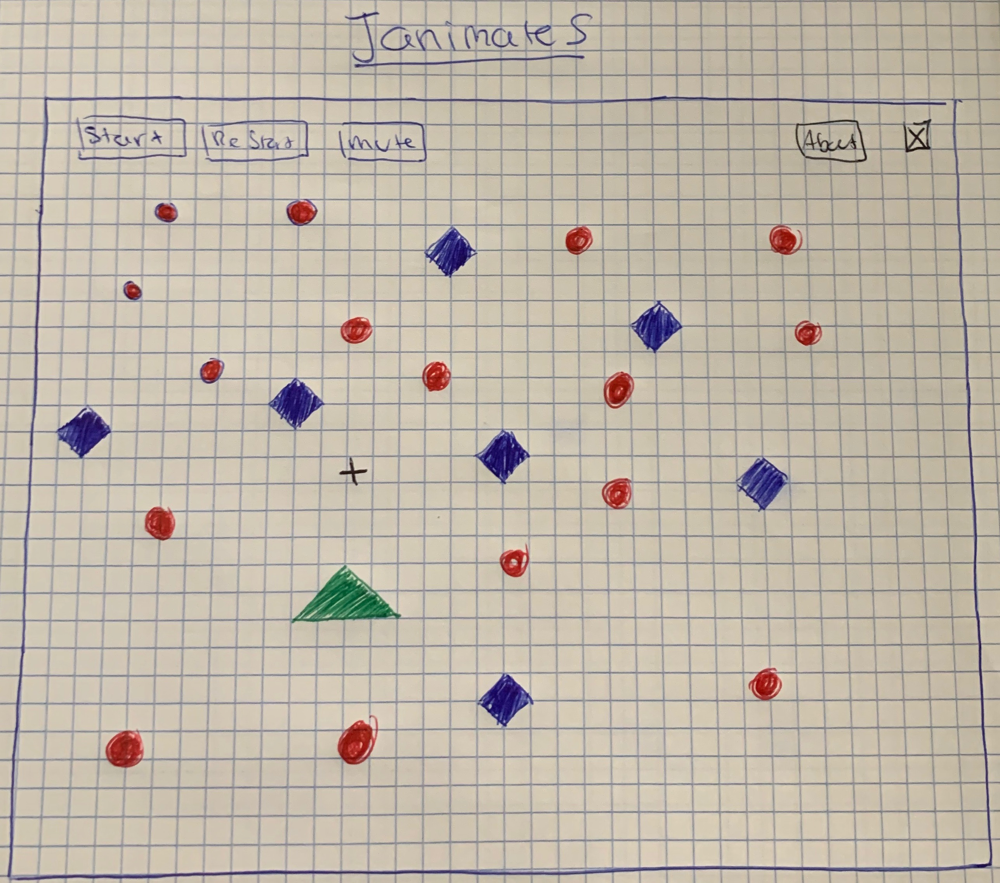

* JanimateS

    ## Background and Overview:
    * JanimateS is a similar game to the asteroids javascript game where the player is represented by a ship/circle in the canvas/space. There will astoroids coming from all directions into close proximity to the user's ship. The way the user can defend or play is by choosing a direction with the arrow keys (want to incorporate following the mouse) and by cliking on the incoming asteroids to make them dissapear. 

    * Motivation for the game was the visualization and physics challenge behind the game. I like the idea of the game and the simplicity presented to the user. 

    ## Functionality and MVP Features
    * Basic visuals/interactive interface.
    * Player can move ship around/choose direction for ship to follow (Either with arrow keys or mouse drag).
    * Asteroids are generated and move     toward the ship. Asteroids come in from all direnctions.
    * Asteroids cause player to loose upon collision. 
    * Music as background while game is in session.

    ## Architecture and Technologies
    * Vanilla JavaScript:
        * Game logic.
    * HTML5 Canvas: 
        * Rendering and visualization.
    * Howler.js (or HTML audio player): 
        * Game background music. (bonus)
    * Tree.js: 
        * Animation and 3D. (Bonus)
    * Webpack: 
        * Bundle various scripts into a    single source.
        * asteroid.js: 
            - Moving asteroids code.
        * game.js:
            - Main game logi code.
        * game_view.js:
            - Store the gameView instances and canvas code. 

    ## Implementation Timeline
    * Day 1: Finish brainstorming and researching technologies and libraries. Start reviewing projects from curriculum and notes that will provide better understanding of concepts to use in project.
    * Day 2: Start project skeleton. Get started on first MVP: Basic visual rendering/interface.
    * Day 3: Continue working and ideally finish first MVP and get started on second MVP: allowing player to move, choose direction of ship.
    * Day 4: Finish player/ship mobility. Ideally start asteroids generation and mobility logic.
    * Day 5: Finish asteroids generation collision logic.
    * Day 6: Start audio implementation while game is being played. 
    * Day 7: Finish audio and final touches.

    ## Wireframe: 
    
